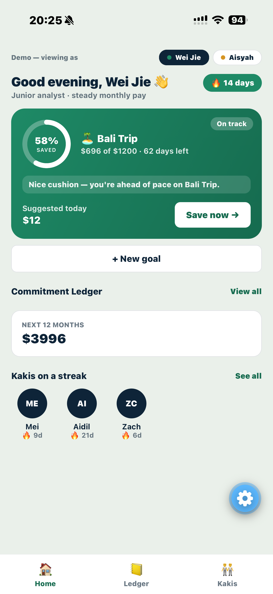
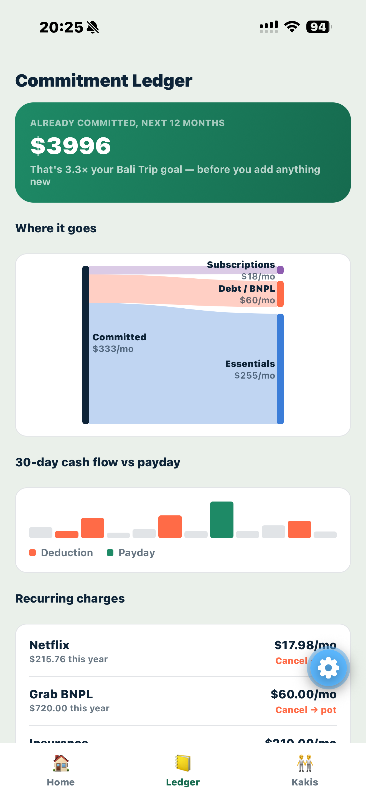
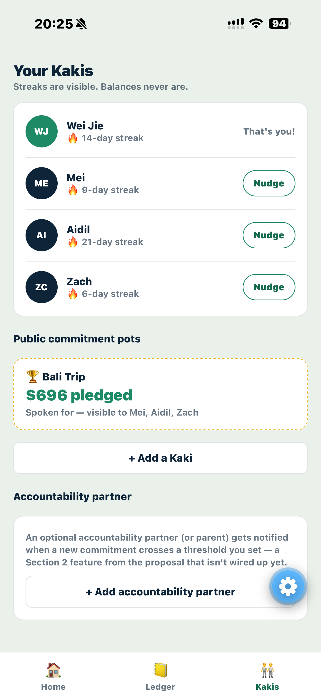

# MoneyKaki

**A savings companion for Singapore's gig workers and young professionals — built by Team Mega Bite.**

MoneyKaki turns "I should really save more" into a daily habit: flexible
savings goals with streaks and gems instead of rigid auto-deductions, a
Commitment Ledger that turns cancelling a subscription into watching money
land straight in a goal, and Kakis (buddies) who keep you accountable —
plus CPF-aware guidance for platform workers, cited straight from official
sources, not guessed.

This repo is the working React Native / Expo frontend from the proposal's
Section 4 architecture ("Cross-platform mobile client for iOS and Android
from a single codebase"), backed by real local state — every button on
screen actually does something. It's frontend-only for now: see
[Known gaps](#known-gaps--deliberately-deferred) for what's simulated vs.
what needs a backend.

## Screenshots

<table>
<tr>
<td width="33%"><br/><sub><b>Home</b> — Wei Jie, on-track (green) persona, goal card + pace nudge</sub></td>
<td width="33%"><br/><sub><b>Ledger</b> — 12-month headline, "where it goes" Sankey, recurring charges</sub></td>
<td width="33%"><br/><sub><b>Kakis</b> — friend streaks, nudge, public commitment pot</sub></td>
</tr>
</table>

*Still missing: Aisyah's amber "getting by" theme, her CPF snapshot on Goal Detail, and the pace-risk warning modal — grab those from her profile (tap "Aisyah" on Home) if you want the full set.*

## Quick start

Requires Node 18+ and the [Expo Go](https://expo.dev/go) app on your phone
(or an iOS/Android simulator).

```bash
npm install
npm start
```

Scan the QR code with Expo Go, or press `i` / `a` in the terminal for a
simulator. Hitting an install/build issue? See [SETUP.md](./SETUP.md) for
a full walkthrough and troubleshooting.

## What's in the demo

Home has a "Demo — viewing as" switcher that flips the whole app between
two accounts, both taken from the proposal's own Appendix personas, so you
can see both ends of the experience without needing real user data:

- 🟢 **Wei Jie** — salaried, on track, saving for a trip while a few
  subscriptions and a BNPL plan quietly add up.
- 🟡 **Aisyah** — a private-hire driver with variable daily income,
  behind pace on an Emergency Fund with a tight deadline. This is the
  "falling through the cracks" view: pace messaging, streak-reset framing,
  and a pace-risk warning screen are all tuned to be honest without being
  punitive — directly addressing the proposal's "motivation drops after
  setbacks" pain point.

Each persona carries its own color theme (green for on-track, amber for
getting-by) applied consistently across every screen, not just Home.

## Features

| Feature | Where | Notes |
|---|---|---|
| Goals, streaks & gems | Home, Goal Detail | Real contributions, pace-aware nudge copy, streak freeze, sub-goal checkpoints |
| Commitment Ledger | Ledger screen | "Cancel → pot" redirects a cancelled charge's freed monthly amount straight into your active goal |
| "Where it goes" Sankey | Ledger screen | Dynamic flow diagram of committed spend by category (Essentials / Subscriptions / Debt-BNPL), built on `react-native-svg` |
| Pace-risk warning | Goal Detail | A one-time, non-punitive modal when a goal falls behind pace, with a computed shortfall and a one-tap fix |
| CPF snapshot | Goal Detail (platform workers) | Illustrates CPF Board's own published contribution/allocation rates — **not a calculator** — always cited, always links to CPF Board's real calculator |
| Contextual resources | Ledger, Goal Detail | Real gov.sg links (CPF, MoneySense) surfaced only when relevant, not as a FAQ page |
| Kakis (accountability) | Kakis tab | Friend streaks, nudges, a shared commitment pot, accountability-partner threshold alerts |

## Screens

| Screen | File | Notes |
|---|---|---|
| Home | `src/screens/HomeScreen.js` | Streak badge, goal card, persona switcher, ledger summary, friends preview |
| Goal Detail | `src/screens/GoalDetailScreen.js` | Contribution input, streak/gems/freeze, pace-risk warning modal, CPF snapshot, checkpoints |
| Commitment Ledger | `src/screens/LedgerScreen.js` | 12-month headline, Sankey breakdown, 30-day cash-flow strip, cancel→pot |
| Kakis (Accountability) | `src/screens/FriendsScreen.js` | Friend streak list, nudge, accountability partner |

Navigation: a bottom tab bar (`Home`, `Ledger`, `Kakis`) with a native
stack nested inside the `Home` tab so Goal Detail pushes/pops the way it
would on iOS/Android.

## Tech stack

React Native + Expo (SDK ~57), React Navigation (bottom tabs + native
stack), React Context + `useReducer` for shared state, `react-native-svg`
for every chart (progress rings, donuts, the Sankey — no charting library),
and the RN `Animated`/`Linking` APIs for animation and outbound links. No
new dependencies were added beyond what Expo ships with by default.

## Real backend, wired up

The proposal's Section 4 architecture calls for a real Goal & Streak
service behind this app — that service now exists (a separate repo, a
NestJS + Prisma API against a live Postgres/Neon database), and this app
talks to it for real, not just as a "next steps" bullet point.

- **What's real:** every contribution (`contribute()` in
  `src/state/AppState.js`, via `src/state/api.js`) is sent to the
  backend's `POST /api/goals/:id/contributions` in the background, after
  the UI updates instantly off local state. The first time a given goal
  is ever contributed to, it's lazily created on the backend first (`POST
  /api/goals`) — none of the demo personas' preset goals need to exist
  there ahead of time. Wei Jie and Aisyah write to two separate seeded
  backend users (`demo-weijie` / `demo-user`) so their goals don't collide
  on the same account now that there's no auth yet.
- **It's demo-safe by design:** the sync is fire-and-forget with a 4s
  timeout. If the backend isn't running, every write just stays local —
  nothing blocks, nothing crashes, nothing shows an error. Goal Detail has
  a small status line under the contribution button ("☁️ Synced to the
  live backend" vs "📱 Local only") so you can actually see it flip live
  once the backend picks up a contribution.
- **What's still local-only:** Ledger, Kakis/Social, gamification (gems,
  freezes), and the CPF snapshot — the backend's own README labels those
  modules as scaffolding with no logic yet, so there's nothing real to
  sync them to.

**To see it live:** run the backend from its own repo (`pnpm start:dev`
inside `apps/api`, per its README — you'll need a Postgres connection
string, Neon or local Docker, and to run its Prisma migration + seed
once). Then just use this app as normal; `src/state/api.js` defaults to
`http://localhost:3000` (right for a simulator on the same machine — swap
in your machine's LAN IP at the top of that file if you're on a physical
phone in Expo Go).

## Financial-literacy content, done responsibly

As a third-party app, MoneyKaki doesn't compute or report anyone's actual
CPF contribution — that would overstep into territory that belongs to CPF
Board. What it does instead: illustrate CPF Board's own published rate
tables (contribution split, account allocation) for one age band, with an
explicit disclaimer, source citations, and a prominent link to CPF Board's
real calculator for an actual personalised number.

Sources used (checked live before hardcoding, not from memory):
- [CPF contribution rates for platform workers](https://www.cpf.gov.sg/employer/platform-operators/obligations/how-much-cpf-contributions-to-pay-platform-workers) — CPF Board
- [CPF allocation rates from 1 January 2026](https://www.cpf.gov.sg/content/dam/web/employer/employer-obligations/documents/CPFAllocationRatesfromJanuary2026.pdf) — CPF Board (PDF)
- [Platform Worker CPF Contribution Calculator](https://www.cpf.gov.sg/member/tools-and-services/calculators/platform-worker-cpf-contribution-calculator) — CPF Board, linked as the real source of truth
- [3 traps to avoid when you go shopping](https://www.moneysense.gov.sg/3-traps-to-avoid-when-you-go-shopping/) — MoneySense (MAS), the BNPL tip on the Ledger screen

If these get reused for a different age band or the rates change, update
the constants at the top of `src/components/CpfSnapshot.js` and re-verify
against the CPF Board pages above rather than guessing.

## Proposal alignment

- **Flexible goals & streaks** (Section 2): goal creation, variable daily
  contributions, streaks, gems, streak freeze, checkpoints, and pace-aware
  nudge copy are all wired to live state. Missing: the actual 23:59 push
  notification and streak-breaking-on-miss (there's no concept of a "day"
  passing in this demo yet, so a streak can only go up).
- **Commitment Ledger** (Section 2): 12-month headline, cancel→redirect
  loop, manual "+ Add a recurring charge" (the proposal's Phase 2 fallback
  before bank-feed integration), and the Sankey breakdown are all live.
- **Social & accountability** (Section 2): friends, nudge, and a public
  commitment pot tied to the active goal, plus an accountability-partner
  threshold that fires a simulated notification.
- **Gamification / AI layer** (Sections 2 & 4): gems, streak freeze, and a
  stand-in AI Nudge Service (`src/state/nudges.js`) — a local template
  generator today, shaped to swap in a real Claude API call later.

## Future ambitions (from the proposal)

What's built so far — this app plus the [`moneykakiGroup`](#real-backend-wired-up)
backend — is Phase 1 of a four-phase plan the proposal lays out, and a
first, honest step toward its longer-term architecture. Worth stating
plainly what's still ahead, rather than letting the working demo imply
more than it is:

- **The backend becomes six services, not one.** The proposal's target
  architecture is independently deployable microservices — Goal & Streak,
  Commitment Ledger, Social & Accountability, Notification, Gamification,
  and AI Nudge — behind an API gateway, each scaling on its own. Today
  it's a single NestJS app with those same six domains already split into
  separate modules (see `apps/api/src/`), with only Goal & Streak wired to
  real logic — the module boundaries are already where the proposal's
  service boundaries would eventually be cut.
- **Real bank/card feeds.** The Commitment Ledger is manual-entry only
  right now; the proposal calls for open-banking/statement-aggregation
  coverage across major Singapore issuers and BNPL providers so it
  auto-populates, with screenshot-plus-OCR (e.g. AWS Textract) as the
  fallback for institutions without API access.
- **Employer/payroll partnerships** for auto-save-on-payday as a direct
  deduction option, and deeper CPF-aware guidance for gig workers under
  the Platform Workers Act — building on the illustrative CPF snapshot
  that exists today.
- **A deeper AI financial coach** — cash-flow forecasting a week ahead,
  insurance-renewal renegotiation prompts, and spending-pattern insights —
  layered on top of today's template-based nudge copy (`src/state/nudges.js`)
  once it's swapped for a real AI Nudge Service call.
- **A family/guardian view** of the accountability-partner feature, for
  students and younger first-jobbers building savings habits under
  parental visibility with consent.
- **B2B / white-label**: offering the Commitment Ledger diagnostic to
  banks and fintechs as an embedded feature, plus marketplace
  partnerships (insurance switching, subscription bundles) surfaced
  directly from ledger insights.
- **Scale-out infrastructure**: event-driven processing (Kafka/SQS)
  decoupling notification volume from the core app, and cloud-native
  containerised deployment for autoscaling and eventual multi-region
  rollout beyond Singapore into other Southeast Asian gig/BNPL markets.
  The gamification schema (gems, freezes, pots) is already deliberately
  generic so new power-ups slot in without a data-model rework.

## Known gaps / deliberately deferred

- **No persistence yet** — state is in-memory and resets on reload.
  `@react-native-async-storage/async-storage` is the natural fix; it hit a
  file-lock error in the environment this was built in (likely OneDrive
  syncing mid-install) — try `npx expo install @react-native-async-storage/async-storage`
  locally, ideally with OneDrive sync paused.
- Screenshot "proof" on Goal Detail is a visual toggle only — no real
  camera/file picker wired up yet (`expo-image-picker` is the natural add).
- No real 23:59 push notification, and no streak-breaking-on-miss
  simulation.
- No auth, no backend — see [Next steps](#next-steps).

## Project structure

```
App.js                          # navigation root + AppProvider + toast host
src/
  theme/tokens.js                # colors, radius, spacing, type scale
  state/
    AppState.js                   # shared Context + reducer (goals, streak, gems, ledger, friends)
    nudges.js                     # pace-aware nudge copy generator
  components/
    Common.js                    # Card, StreakPill, buttons, Toast, FormSheet, Pulse, ResourceTip
    GoalCard.js                  # persona-colored goal card + progress ring + pace line
    ProgressRing.js               # animated SVG circular progress
    DonutChart.js                 # reusable multi-segment ring chart
    SankeyFlow.js                 # "where it goes" flow diagram
    CpfSnapshot.js                # cited, illustrative-only CPF rates card
  screens/
    HomeScreen.js
    GoalDetailScreen.js
    LedgerScreen.js
    FriendsScreen.js
```

## Design tokens

All colors, radii, spacing and type live in `src/theme/tokens.js`:

- `colors.jade` / `colors.jadeDark` — savings, on-track persona accent
- `colors.amber` / `colors.amberDark` — getting-by persona accent
- `colors.coral` — streaks, deductions, urgency, pace-risk warnings
- `colors.gold` — gems, rewards, pledged pots, official-resource cards
- `colors.ink` — dark surfaces, primary text
- `colors.sage` — screen background
- `type.*` — the font scale every screen uses instead of inline sizes

## Next steps

- Replace `src/state/AppState.js`'s in-memory reducer with real calls to
  the Goal & Streak, Commitment Ledger and Social services once the
  backend exists — action names (`contribute`, `cancelCharge`,
  `nudgeFriend`, `addFriend`, `addGoal`) are already shaped like the API
  calls they'll become.
- Add AsyncStorage persistence (see Known gaps).
- Add auth + the 23:59 contribution reminder notification flow.
- Swap `getPaceMessage()` in `src/state/nudges.js` for a real AI Nudge
  Service call (Claude API) once that service exists.
